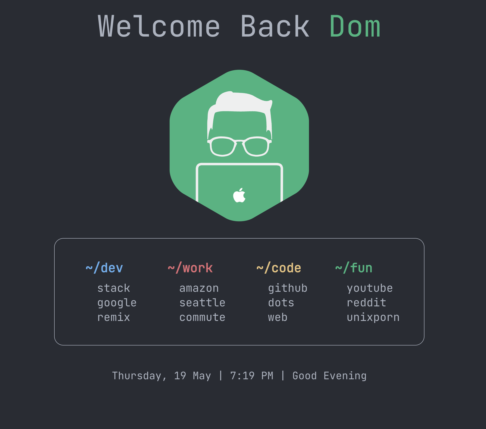

# dominicklee.net

My personal side but reimagined

## Project Todo

- [x] Toggleable Theme
- [ ] Better [Prettier Rules](https://prettier.io/docs/en/options.html)
- [ ] [Prisma vs Mongoose](https://dev.to/somsubhra1/journey-from-mongoose-to-prisma-orm-for-mongodb-3j21)

### [Startpage](https://the-awesome-domogami-site.netlify.app/startpage)

I created a startpage that I use as my web browser homepage and new tab default page. It contains quick links and categories in a way that is consistent with my theme. I also display the date and time at the bottom to give me an idea of how long I've been at my computer.

Inspiration from [startpages](https://startpages.github)
Really enjoyed this [homepage](https://fxzzi.github.io/catStartpage/) by [Fazzi](https://github.com/Fxzzi?tab=repositories)
